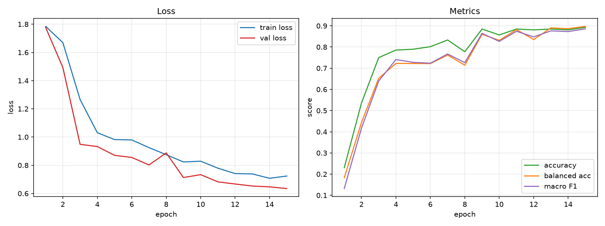

# PyTorch Image Classification Lab

[](LICENSE)
[](pyproject.toml)
[](.github/workflows/ci.yml)

**Read this in: [简体中文](README.zh-CN.md)**

A practical PyTorch project for learning a reproducible image-classification
workflow, from data preparation to evaluation and error analysis. The example
task classifies cardboard, glass, metal, paper, plastic, and trash.

## Is this project for you?

This project is aimed at learners who know basic Python and have an intuitive
understanding of tensors, loss, and gradients, but have not yet completed a
full image-classification project. It does not assume that you can implement a
CNN or read research papers.

The recommended path takes about **8–12 hours**. If logits, loss, or gradients
are still unfamiliar, read the [minimum deep-learning concepts](docs/tutorial/00-basics.zh-CN.md)
before starting.

## Start here

The first goal is one complete, short run:

```text
prepare data -> dry run -> train -> evaluate -> predict
```

Create the environment and install the project:

```bash
uv venv
source .venv/bin/activate              # Windows: .venv\Scripts\activate
uv pip install -e ".[dev]"
```

Check that the CLI and the deliberately simple configuration resolve:

```bash
garbage --help
garbage show-config --config configs/learning_minimal.yaml
```

Download the audited public dataset and build fixed train, validation, and
test manifests:

```bash
python scripts/download_data.py
garbage prepare-data --set data.data_dir data/raw
```

Before committing to a full run, train one batch only:

```bash
garbage train --config configs/learning_minimal.yaml --dry-run
```

Look for `dry-run OK` with an input shape, output shape, and loss. That line
means the data loader, model, forward pass, loss, and backward pass all worked.
It does not mean the model has learned yet.

Run two epochs to produce a real checkpoint and metric history:

```bash
garbage train --config configs/learning_minimal.yaml \
  --set train.epochs 2 --set run_name first-run
```

The files under `artifacts/first-run/` answer different questions:

- `config.yaml`: which settings actually took effect?
- `metrics.csv`: how did training and validation change by epoch?
- `best.pt`: which checkpoint should evaluation and prediction use?

## Inspect the result

Evaluate the held-out test split and then predict one image:

```bash
garbage evaluate --checkpoint artifacts/first-run/best.pt --plot
garbage predict --checkpoint artifacts/first-run/best.pt \
  --image data/raw/paper/paper1.jpg --top-k 3
```

Do not stop at the headline accuracy. Compare balanced accuracy and macro F1,
look for weak classes in the report, and open `errors.csv` before changing the
model. A short first run may perform poorly; its purpose is to expose the whole
workflow while each part is still easy to inspect.

Prediction restores the model name, class names, and preprocessing values from
the checkpoint. You do not need to repeat training settings by hand.



A verified 15-epoch run reached 93.33% test accuracy. Read the
[reference-run notes](docs/reference-run.md) for the exact configuration,
environment, class-level results, and the limits of that number.

## What to read next

- Follow the [learning path](docs/learning-path.md) for a recommended reading
  order and small runnable comparisons.
- Use the [code tour](docs/code-tour.md) to trace data, configuration, training,
  evaluation, and inference without reading every file in sequence.
- Read [how it works](docs/how-it-works.md) when a design choice needs more
  explanation.
- Use the [experiment guide](docs/experiments.md) to compare one change at a
  time.
- The detailed hands-on tutorials are currently available in
  [Chinese](docs/tutorial/README.zh-CN.md).

## Use another dataset

The same pipeline works with any image dataset arranged as one folder per
class. The [own-data guide](docs/using-your-data.md) shows how to preview it,
create isolated manifests, run a short baseline, and inspect errors without
overwriting the example data split.

## What the project covers

The core path includes:

- audited, reproducible train/validation/test manifests;
- YAML configuration with visible defaults and CLI overrides;
- a readable training loop with checkpoints and resume support;
- per-class precision, recall, F1, balanced accuracy, confusion matrices, and
  error samples;
- single-image and batch prediction from a self-contained checkpoint.

After the core workflow makes sense, optional tools add pretrained CNN and
Transformer backbones, AMP, early stopping, MixUp/CutMix, EMA, imbalance
strategies, TTA, Grad-CAM, ONNX export, and a Gradio demo.

```bash
garbage explain --checkpoint artifacts/first-run/best.pt \
  --image data/raw/paper/paper1.jpg
garbage bench

uv pip install -e ".[onnx]"
garbage export-onnx --checkpoint artifacts/first-run/best.pt --output model.onnx

uv pip install -e ".[demo]"
garbage demo --checkpoint artifacts/first-run/best.pt
```

## Configuration and models

Values are resolved in this order:

```text
dataclass defaults < YAML file < --set overrides < dedicated CLI flags
```

The [configuration reference](docs/config-reference.md) documents every field.
The minimal configuration keeps advanced techniques off so the first training
loop remains visible. The model registry also provides maintained timm and
torchvision ResNet, MobileNetV3, EfficientNet, ConvNeXt, RegNet, Swin, and ViT
backbones. Run `garbage bench` to compare their parameter counts and optional
FLOPs.

## Repository map

```text
examples/                    five small programs to run and read first
configs/                     ready-to-run experiment settings
docs/                        learning path, tutorials, and code tour
scripts/                     download, preview, and plotting utilities
src/garbage_classifier/      installed application and reusable package
tests/                       behavior checks and advanced reference examples
data/                        local dataset and manifests (gitignored)
artifacts/                   local runs and checkpoints (gitignored)
```

When learning, start with `examples/`, then follow documentation into `src/`.
When contributing, read [CONTRIBUTING.md](CONTRIBUTING.md) and the local guides
in [scripts](scripts/README.md), [src](src/README.md), and
[tests](tests/README.md).

## Documentation

- [Learning Path](docs/learning-path.md) · [中文学习路线](docs/learning-path.zh-CN.md)
- [Code Tour](docs/code-tour.md) · [中文代码导览](docs/code-tour.zh-CN.md)
- [Configuration Reference](docs/config-reference.md) · [中文参数参考](docs/config-reference.zh-CN.md)
- [How It Works](docs/how-it-works.md) · [中文原理说明](docs/how-it-works.zh-CN.md)
- [Experiments](docs/experiments.md) · [中文实验说明](docs/experiments.zh-CN.md)
- [Reference Run](docs/reference-run.md) · [中文参考运行](docs/reference-run.zh-CN.md)
- [中文实操教程](docs/tutorial/README.zh-CN.md)

## License

[MIT](LICENSE)
