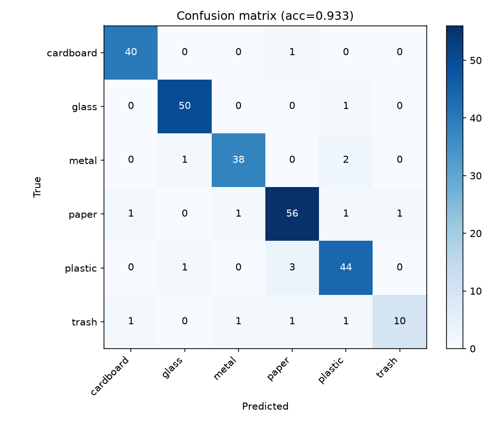

# ResNet50 参考运行

[English](README.md) | [项目首页](../../README.zh-CN.md)

此目录将已发布结果的说明与机器可读证据分开。它不包含模型 checkpoint 或源图像。

| 项目 | 值 |
| --- | --- |
| 模型 | timm ResNet50，ImageNet 初始化 |
| 数据 | 已审计六类垃圾图像，固定 strict 切分 |
| 训练 / 验证 / 测试 | 2,017 / 252 / 255 |
| checkpoint 选择 | 验证集 balanced accuracy |
| 测试 accuracy | 0.9333 |
| 测试 balanced accuracy | 0.9079 |
| 测试 macro F1 | 0.9176 |

`config.yaml` 是发布的请求配置。原结果产生于 schema-v2 数据和 checkpoint 契约之前；其历史元数据和曲线是当时 revision 的证据，并非可以安全恢复的 schema-v2 产物。要复现当前参考，应重新准备数据，并将生成的 `run.yaml`、`metrics.csv` 和 `evaluation/evaluation.json` 与文档范围比较。

